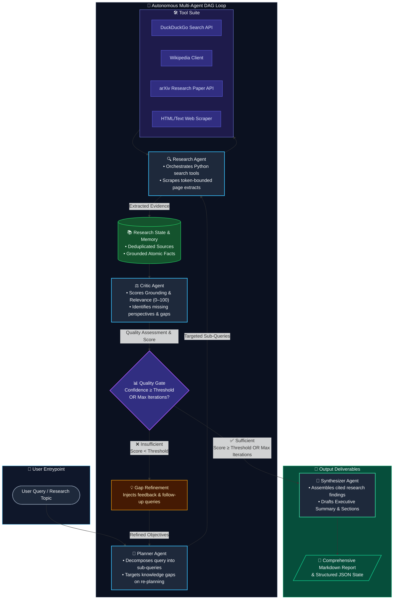
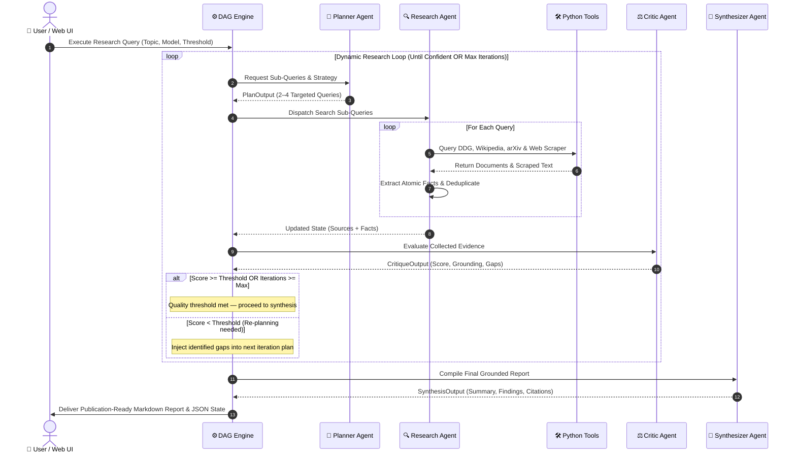

# Local Multi-Agent AI Research Assistant

A local-first, autonomous multi-agent research assistant built with **Python**, **Ollama** (optimized for 3B open-weight models), a **Directed Acyclic Graph (DAG)** execution loop, and custom Python tool calling.

## 🏗️ Architecture & Execution Loop

### 🔄 Multi-Agent Directed Acyclic Graph (DAG)



### 🔁 Execution Sequence Diagram



---

## 🚀 Interfaces & User Experience

### 1. Interactive Streamlit Web Dashboard (`app.py`)
A full web UI featuring real-time DAG progress tracking, interactive agent tabs, and one-click file downloads.

```bash
# Launch Streamlit Web UI
streamlit run app.py
```

**Web UI Features:**
- ⚙️ **Sidebar Controls**: Model selection, Ollama endpoint detector, mock simulator toggle, confidence threshold slider, max iterations, search provider toggles.
- 📌 **Preset Topics**: 1-click test runs on complex research domains.
- 📑 **Report Viewer**: Rendered Markdown with citation links, executive summaries, and `.md`/`.json` download buttons.
- 🧠 **Planner Analysis**: Sub-query decomposition inspection and reasoning.
- 🌐 **Evidence & Fact Explorer**: Expandable source document previews and grounded atomic facts.
- ⚖️ **Critic Quality Audit**: Confidence, relevance, and factual grounding meters + auditor feedback.
- ⏱️ **DAG Execution Trace**: Interactive step-by-step audit trail table.

---

### 2. Enhanced Terminal Rich CLI (`local_researcher/cli.py`)

```bash
# Run with Local Ollama
python -m local_researcher.cli "Autonomous Multi-Agent AI Architectures in 2025" --model llama3.2:3b --output-file report.md

# Run Offline / Mock Mode
python -m local_researcher.cli "Deep Learning Optimization Techniques" --mock --output-file report.md --json-out state.json
```

**CLI Features:**
- 🎨 Modern color-coded agent tags (`[PLANNER]`, `[RESEARCHER]`, `[CRITIC]`, `[SYNTHESIZER]`).
- 📊 Real-time ASCII progress gauges (`[████████░░] 85%`).
- ⚖️ Critic scorecard table and decision gate status.
- 🏆 Post-execution summary card with elapsed timing, iterations count, and source metrics.

---

## 🧪 Testing

```bash
# Run the complete test suite (27 unit & integration tests)
python -m pytest -v
```
